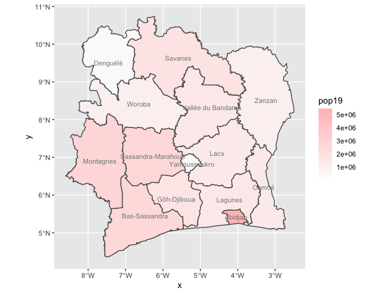
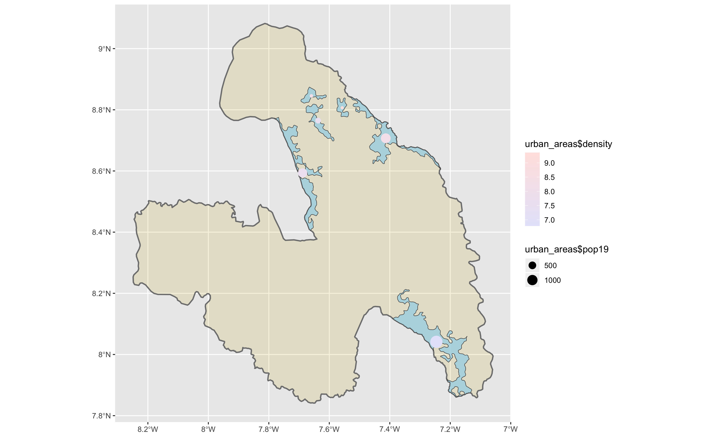
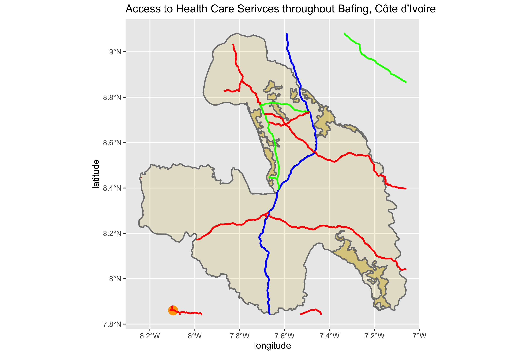

# Côte d'Ivoire

This is my final project on Côte d'Ivoire:

Starting from a high-up view of the country, we saw that most of the population condensed in more urban areas (or, at least, places that I knew were highly popular). This was shown with the following plot:

Places closer to the border with Liberia and Guinea as well as the capital city and surrounding area of Abidjan) were highly and densely populated (amount and amount per square kilometer, respectively). Whereas closer to the center of the country seemed to be more sparsely populated.

Eventually, I moved to a closer perspective with the aforementioned second administrative subdivision (adm2) of Abidjan. However, converting this area to a raster and extracting the data proved to be too large of a task for my computer so, inevitably, I moved to a smaller adm2 (population-wise) called Bafing. With a current population of around 180,000, this was far easier to handle than almost 4.5 million people. Additionally, it looked nicer on a political map, which is always nice:

The next step in my presentation was to find urban developments and find how densely populated said areas were. I did so and it yielded these results:

This plot shows that the larger areas (landsize) tended to have larger populations as well. While this may be expected, they had a greater population by a large enough amount that they were able to overcome the other population densities.

Finally, the last step was to map the road networks, bodies of water, and the healthcare facilities (HCFs). I produced the following plot:

This doesn't map any bodies of water because, in the adm2 of Bafing, there are none. However, there were a few road networks and one HCF that was close enough to consider accessible (look for an orange dot in the bottom left of the image). The roads are colored in Red, Blue, and Green (Primary, Secondary, and Tertiary, respectively) because RGB.

I wasn't able to overlay the roads and HCFs onto the political map because of gross-negligence, overestimation of my own abilities, lack of time, and a conceptual shortcoming with RStudio. Nonetheless, I learned a lot about how to use R and I enjoyed using a scripting language as opposed to another object-oriented (or makeshift object-oriented) language.

